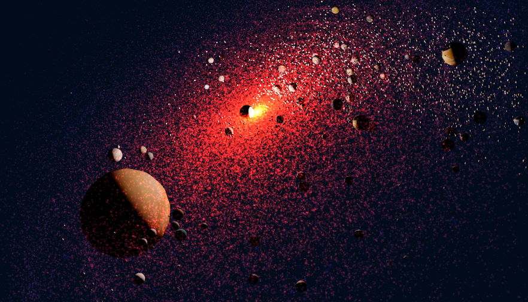

# 3D Star Wars Galaxy

[](https://star-wars-galaxy.vercel.app)

A 3D version of the Star Wars Galaxy map based on multiples data sources.
You can check the map here : [star-wars-galaxy.vercel.app](https://star-wars-galaxy.vercel.app).

*Notice : If something seems incorrect in the planets sizes, textures, rotation behaviors or anything, feel free to create an issue or a PR to maintain the project and make it closest of the lore.*

## Table of contents

- [3D Star Wars Galaxy](#3d-star-wars-galaxy)
  - [Table of contents](#table-of-contents)
  - [Project origins](#project-origins)
  - [For developers](#for-developers)
    - [Start project](#start-project)
    - [You have 2 possibilities of file import](#you-have-2-possibilities-of-file-import)
      - [1. Static data already treated](#1-static-data-already-treated)
      - [2. Dynamic data from a fresh extract](#2-dynamic-data-from-a-fresh-extract)
    - [How to access to the debug view ?](#how-to-access-to-the-debug-view-)


## Project origins

I wanted to represent a living 3D version of the Star Wars galaxy in order to better interpret the distances and the overall dynamics of the galaxy. I wanted to highlight the discovery of all the planets with the dynamic description system. This whole project would not have been possible without the many cartographic data present on the internet as well as the many wikis on the lore of the planets. Some planets are not necessarily faithful to the logic because their specificities are sometimes debated in the forums without final agreement between users. The project having been started a long time ago now, the planets as well as the galaxy of the Ahsoka series are not displayed. Feel free to update the project if you want.


## For developers

### Start project
Simply use `npm run dev` after dependencies installation.

### You have 2 possibilities of file import

#### 1. Static data already treated

The purpose of `preCleanedData.ts` is to deal with a dataset already cleaned and without known issue. If you prefer to deal with fresh extracted data, you must use the following `index.ts` approach.

Make sure you imported the desired dataset in the following file : `./src/Experience/World/Planets.js`.
````ts
import preCleanedData from '../../data-preparation/data/preCleanedData.ts'
````


#### 2. Dynamic data from a fresh extract

1. Go on the following [website](https://otherlife.davidcanavese.com/galaxymap2/). *I would like to thank [the reddit user](https://www.reddit.com/r/Star_Wars_Maps/comments/12yolnk/ultimate_star_wars_galaxy_map_online_update_and/) who did a lot of work to place many planets on his website, without this first map, this project would have taken much longer to complete.*
2. In the devtools console, copy-paste the content of the following file : `./data-preparation/helpers/leafletToGeoJSON.ts`.
3. Now execute the file function in the devtools console typing : `exportToGeoJSON()` (the function execution is long up to one minute in very slow laptops).
4. Once the function is ended, an object will appears in the console, right click and copy it.
5. Close the following tab, because the map will crash due to instance manipulations used to get the markers popup and tooltips contents.
6. The object you just copied can be pasted to replace the content of `./data-preparation/data/raw_geojson_from_leaflet.json`.
7. Now you have a pretty good dataset, but if you check some details, you can see a lot of non-formatted data, so the `index.ts` is here to clean all of this.
8. Make sure you imported the desired dataset in the following file : `./src/Experience/World/Planets.js`.
````ts
import preCleanedData from '../../../data-preparation/index.ts'
````

### How to access to the debug view ?

I've implemented a debug view, accessible by adding an anchor `#debug` to the URL and reload the page, or simply go here : [star-wars-galaxy.vercel.app#debug](https://star-wars-galaxy.vercel.app/#debug).
